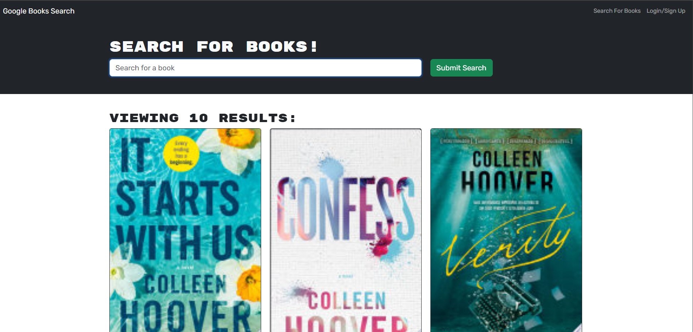

# Ready for a Stellar-Bookquest?!

## Description

This is a Book Search Engine that is a full stack MERN application. It allows individuals to search books and find something to read. You can type what you are looking for in the search engine then books relating to that title or author will populate! Take Colleen Hoover for example in the screenshot below.

## Screenshot 

## Usage

Super Simple! Think of a book or an author, type in the search bar, populate the results! You also have the option to sign in and make an account to see your shared books!

## Deployed Link

To access the deployed page, Click [HERE!](https://stellar-bookquest.onrender.com/)

## Tech Used
- Express.js
- React
- Node.js
- MongoDB
- Apollo
- JWT
- Vite
- Render

## Contact

For any questions or if you want to see more of my work, check out my GitHub: https://github.com/TheKyleKirby 

Thank you for checking everything out!
  